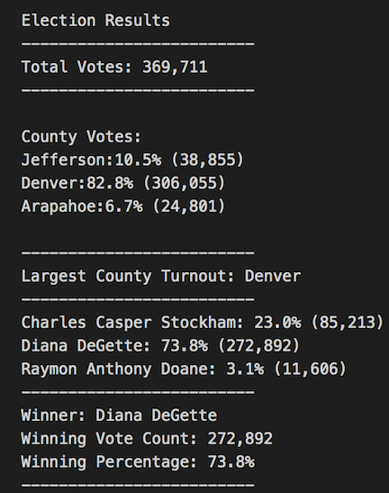

# PyPoll with Python

## Overview of Project
Tom, an employee for the Colorado Board of Elections, has requested our assistance in completeing an election audit of the recent congressional election in Colorado. We have been tasked with reporting the total number of votes cast, the total number and percentage of votes for each candidate, and the winner of the election based on the popular vote. Tom has also asked that we calculate voter turnout for each county and determine the county with the highest turnout. The purpose of this project is not only to audit this recent election, but create a script that can be used to report on elections as a whole. 

## Results
Based on the election analysis, we can report that: 
- There were 369,711 total votes cast in the election. 

- Voter turnout for each county in the precinct:
    - Denver, CO accounted for 82.8% of the vote, reporting a total of 306,055 votes.
    - Jefferson, CO accounted for 10.5% of the vote, reporting 38,855 total votes.
    - Arapahoe,CO accounted for 6.7% of the vote, reporting 24,801 total votes.

- Denver had the largest number of votes, accouting for over 80% of the of the overall voter turnout.

- The congressional candidates were: 
    - Charles Casper Stockham
    - Diana DeGette
    - Raymon Anthony Doane

- Candidate Results: 
    - Raymon Anthony Doane recieved 3.1% of the votes cast, a total of 11,606 votes.
    - Charles Casper Stockham recieved 23.0% of the votes cast, giving him 85,213, total votes. 
    - Diana DeGette recieved 73.8% of the votes cast, which was a total of 272,892 votes.

- The winner of the Colorado Congressional Election was Diana DeGette, recieving 272,892 votes and 73.8% of the votes cast. 

## Summary 

